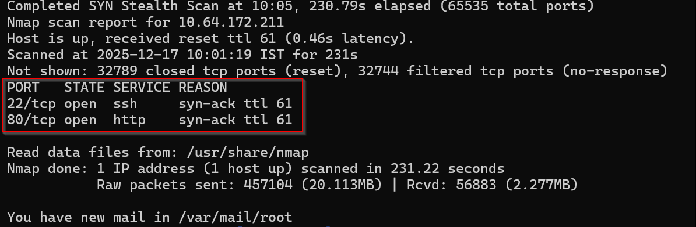
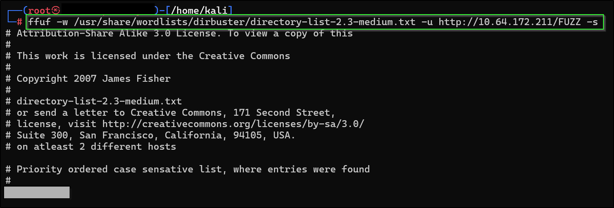
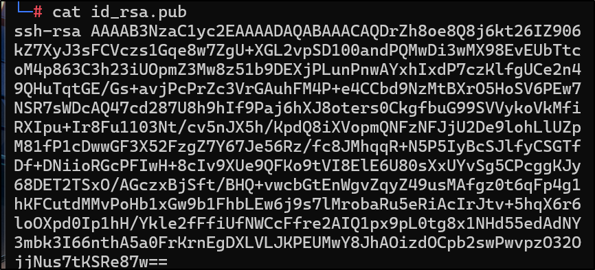
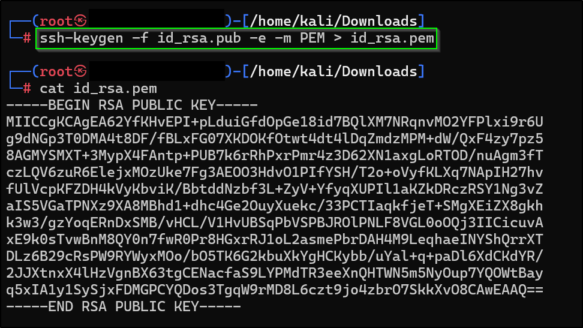

# 📝 Writeup – Breaking RSA (TryHackMe)

---

## SERVICES RUNNING
A quick port scan is enough for this.
```bash
nmap -p- --min-rate 2000 -vv <IP>
```
**Screenshot**:   



ffuf for directory fuzzing
```bash
ffuf -w <wordlist> -u http://<IP> -s
```
**Screenshot**:  



## BREAKING RSA
Get the `id_rsa.pub` from the hidden directory. For `openssl` we need to first convert in into **PEM** format.    
```bash
ssh-keygen -f id_rsa.pub -e -m PEM > id_rsa.pem
```    
**Screenshot**:     





To get details(n, e, bit size) about the public key we can use `openssl` cmds

```bash
openssl rsa -pubin -in id_rsa.pem -text -noout

openssl rsa -pubin -in id_rsa.pem -modulus -text -noout
```

To convert hex number to decimal
```bash
echo "ibase=16; <HEX_STRING>" | bc
```

## FERMAT's FACTORIZATION ALGO
Github: [Fermat's factorization algorithm](https://github.com/murtaza-u/zet/tree/main/20220808171808)

```python
#!/usr/bin/python3
# Let n be a +ve odd integer. Using Fermat's factorization method we can efficiently factorise n into p and q (n = p * q) provided the difference between p and q is small.

from math import floor, isqrt
from Cryptodome.Util.number import inverse
from Cryptodome.PublicKey import RSA

def factorize(n):
    # since even nos. are always divisible by 2, one of the factors will always
    # be 2
    if (n & 1) == 0:
        return (n/2, 2)

    a = floor(isqrt(n))

    # if n is a perfect square the factors will be ( sqrt(n), sqrt(n) )
    if a * a == n:
        return (a, a)

    # n = (a - b) * (a + b)
    # n = a^2 - b^2
    # b^2 = a^2 - n
    while True:
        a += 1
        _b = a * a - n
        b = int(isqrt(_b))
        if (b * b == _b):
            break

    return a + b, a - b

n=int(input("Enter the number: "))
p,q = factorize(n)
e=65537

# computing phi
phi = (p-1)*(q-1)

# private exponent
d = inverse(e,phi)

# RSA private key
key = RSA.construct((n,e,d,p,q))
private_pem = key.export_key()

print("------------------------------------")
print(f"P: {p}")
print(f"Q: {q}")
print(f"Phi: {phi}")
print(f"D: {d}")
print(f"P-Q = {p-q}")
print(private_pem.decode())
```

Save the private key as `id_rsa` give the right permission & login to get the flag ^_^
```bash
chmod 600 id_rsa

ssh -i id_rsa <IP>
```  
